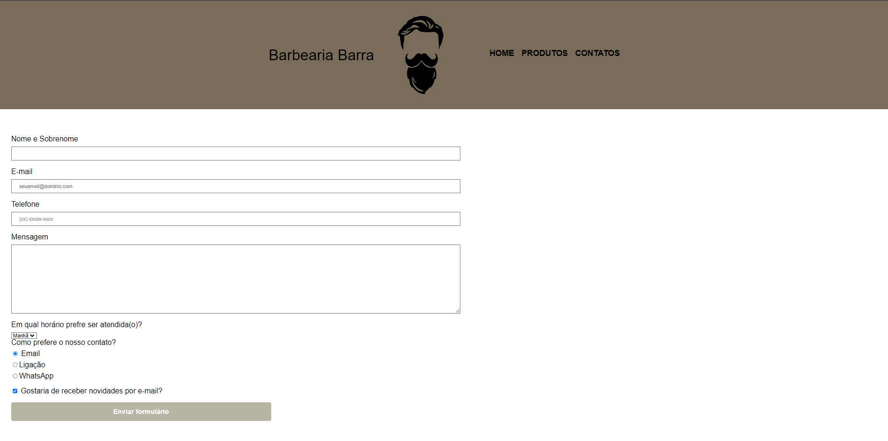

# Sobre
MarketPlace Barbearia da Barra. Realizado a partir de conteúdo do curso de Desenvolvimento Web da Alura. O projeto detalha um site desenhado para barbearias com 
página de apresentação da empresa, página de contatos com formulário e catalógo de serviços; tendo utilizado HTML e CSS, com incorporação de conteúdo externo
do Google Maps e vídeos do Youtube.

# Telas

- Captura de telas da barbearia Barra

 

 

 

 

